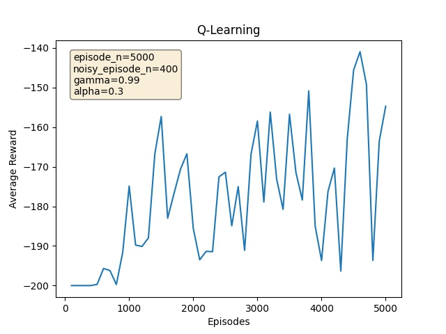
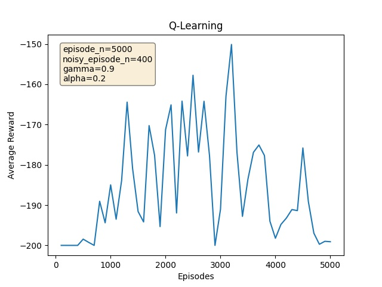
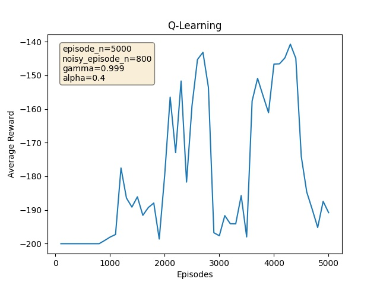
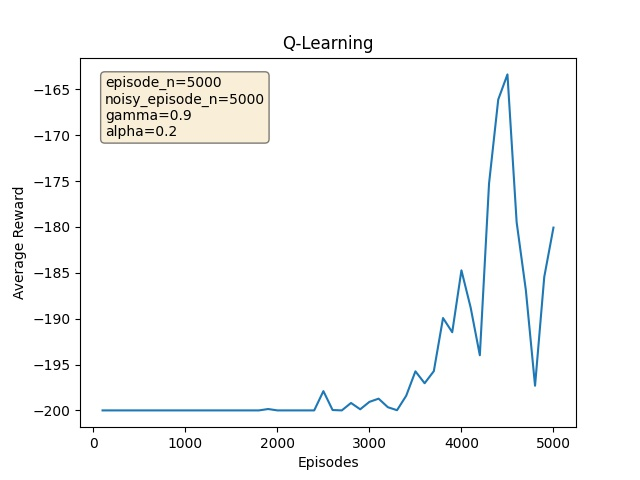
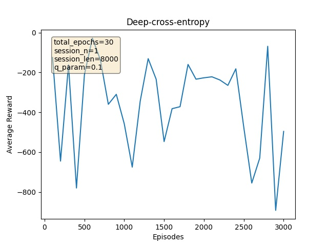
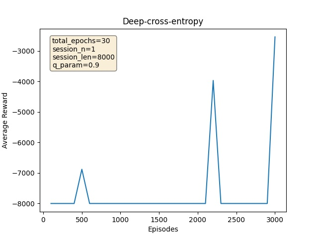

# метод Q-Learning в игре Mountain-Car-v2

## Замечание
Ввиду того, что у меня не получилось реализовать метод Deep Cross Entropy, 
я не могу детально сравнить эти два метода. 
Далее будут представлены графики обучения используя DCE и QL
 при запуске с различными параметрами.
 
 
## Q-Learning
была произведена дискретизация значений следующим образом:  
1) отрезок `[-1.2, 0.6]` позиций машины на горе был переведен во множество `{0, 1, ..., 10}`  
1) отрезок `[-0.07, 0.07]` скорости машины переведен в множество `{0, 1, ..., 99, 100}`

При таких параметрах у меня получилось добиться наилучшего результата|При alpha=0.2 можно наблюдать слабое обучение ввиду умножения награды на этот коэфициент
:---:|:---:
  |  
При данном noisy_episode, в обучении преобладает рандомизация | интересный случай когда noisy_episode == episode_n, здесь эпсилон снижается на 1/5000
  | 
При обучении происходили неболльшие "откаты" по наградам, полагаю это происходило из-за присутствия вероятностного рандома при выборе следующего действия, но видна тенденция на рост колличества наград при 'хороших' начальных параметрах 

## Deep-Cross-entropy
Исправить ситуацию я пытался несколькими способами:
1) Вводил функцию которая награждала агента за скорость и близость к цели
    
2) Но в целом наблюдалась следующая картина:
    
