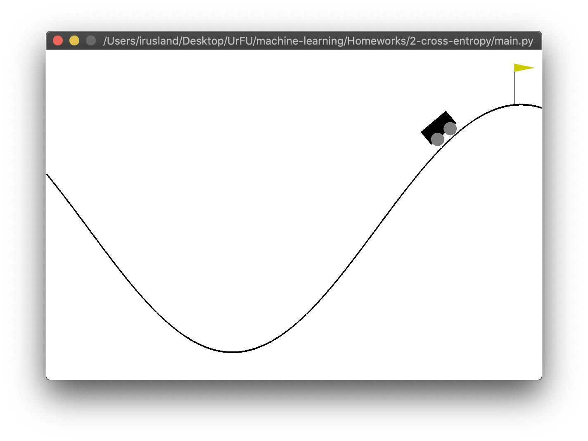

# Machine learning course practice

Repository for showing reinforcement learning techniques

## [Taxi](Homeworks/1-taxi/1-best-params/taxi.py)

Observation space has 600 values  
5 by 5 Field consists of 5 clients positions (RGBY and in taxi)  
and 4 drop positions

Action space has 6 values for agent to be executed  
0...3 - Step North, West, East, South  
4, 5 - dropoff or pickup actions 


    +---------+
    |R: | : :G|
    | : | : : |
    | : : : : |
    | | : | : |
    |Y| : |B: |
    +---------+
    
## [Mountain-Car](Homeworks/1-taxi/1-best-params/taxi.py)
Q-Learning method


    
## Installation

```bash
pip install -r requirements.txt
```

## Usage

Find the main script in task folder 

```bash
python taxi.py
```

Each script has a [README.txt](Homeworks/1-taxi/1-best-params/README.txt) as a notation